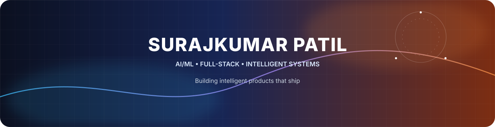
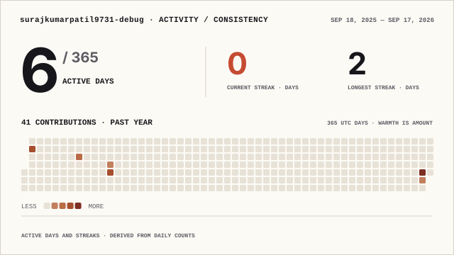
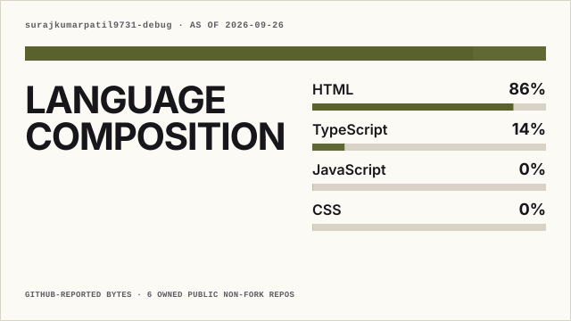
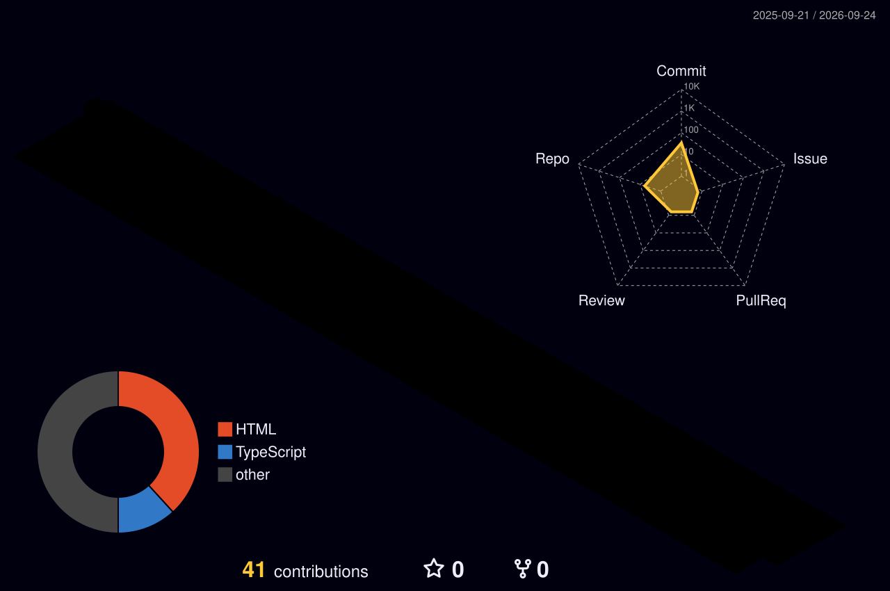

<div align="center">



<br/>

<a href="https://github.com/surajkumarpatil9731-debug?tab=repositories"></a>
<a href="https://www.linkedin.com/in/surajkumar-patil-316817391/"></a>
<a href="mailto:surajkumarpatil9731@gmail.com"></a>

</div>

---

## 👋 About Me

I'm an **AI/ML Engineering student** and **full-stack developer** focused on building practical software, intelligent systems, and polished digital products.

I enjoy the complete engineering loop:

`interface → backend → data → AI → deployment`

### ⚡ Current Build Mode

| Focus | Direction |
|---|---|
| 🤖 **AI / ML** | Intelligent applications & automation |
| 🌐 **Full-Stack** | Modern web apps & production APIs |
| 🛡️ **Cybersecurity** | AI-assisted threat detection |
| 🚀 **Product Engineering** | Idea → prototype → usable product |

---

## 🧠 Engineering Approach

> **Learn deeply. Build consistently. Ship things that matter.**

I care about understanding **why** a system works — not just making it run. Every project is an opportunity to improve architecture, problem-solving, UI, AI, and engineering discipline.

```text
DISCOVER  →  DESIGN  →  BUILD  →  TEST  →  SHIP  →  IMPROVE
```

---

## 🛠️ Technology Stack

<div align="center">

**Languages**


**Frontend • Backend**


**AI • Data • Computer Vision**


**Databases • DevOps • Tools**


</div>

---

## 🚀 Selected Builds

| Project | Focus | Stack |
|---|---|---|
| 🛡️ **[PhishGuardAI](https://github.com/surajkumarpatil9731-debug/PhishguardAi)** | AI-assisted cybersecurity dashboard | TypeScript |
| 🌍 **[Hazard Intelligence Dashboard](https://github.com/surajkumarpatil9731-debug/Hazard-Intelligence-Dashboard)** | Hazard information & visualization | HTML |
| 💪 **[TITAN-FIT-2030](https://github.com/surajkumarpatil9731-debug/TITAN-FIT-2030)** | Fitness-focused web experience | HTML |
| ⚔️ **[Solo Leveling Workout](https://github.com/surajkumarpatil9731-debug/solo-leveling-workout-)** | Gamified workout application | HTML |

---

## 📊 Engineering Analytics

<div align="center">

<picture>
  <source media="(prefers-color-scheme: dark)" srcset="./profile/activity-consistency-wide-dark.svg">
  
</picture>

<picture>
  <source media="(prefers-color-scheme: dark)" srcset="./profile/language-composition-wide-dark.svg">
  
</picture>

</div>

> Analytics are generated into this repository by GitHub Actions — no live stats renderer is required.

---

## 🏙️ Contribution Skyline

<div align="center">



</div>

<p align="center"><sub>Generated automatically from my GitHub contribution history.</sub></p>

---

## 🐍 Contribution Journey

<div align="center">


</div>

<p align="center"><sub>Regenerated automatically from my contribution graph.</sub></p>

---

## 🔬 What I'm Building Toward

```text
AI APPLICATIONS
      │
      ├── intelligent automation
      ├── useful AI interfaces
      └── practical ML systems

FULL-STACK ENGINEERING
      │
      ├── clean interfaces
      ├── reliable APIs
      └── scalable data layers

ENGINEERING DISCIPLINE
      │
      ├── testing
      ├── deployment
      └── continuous improvement
```

---

## 🤝 Let's Build Something Interesting

I'm interested in collaborating on:

- 🤖 AI / ML applications
- 🌐 Full-stack products
- 🛡️ AI + cybersecurity
- ⚙️ Automation & intelligent systems
- 💡 Interesting open-source projects

<div align="center">

<a href="https://github.com/surajkumarpatil9731-debug?tab=repositories"></a>
<a href="mailto:surajkumarpatil9731@gmail.com"></a>

<br/><br/>


</div>

---

<div align="center">


</div>
